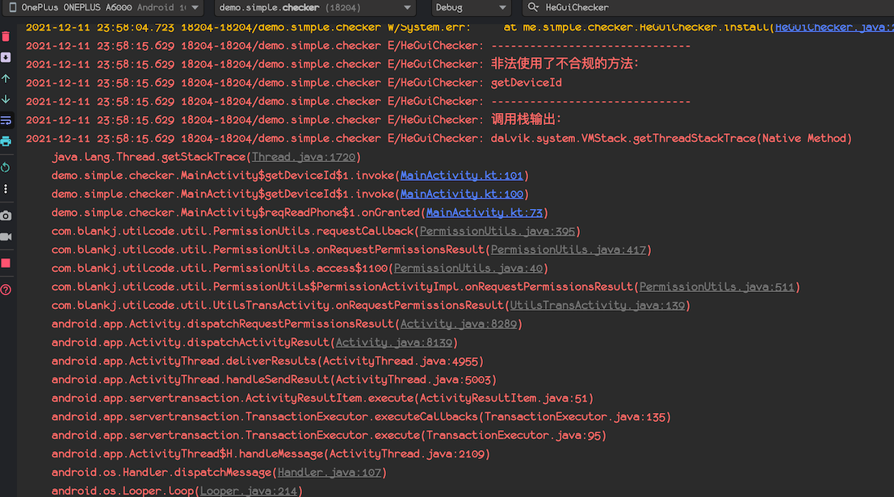
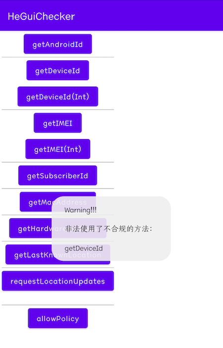

# HeGuiChecker

合规检测器-基于工信部[最新标准](http://www.gov.cn/zhengce/zhengceku/2020-08/02/content_5531975.htm)

基于[Lody](https://github.com/asLody)的[SandHook](https://github.com/asLody/SandHook)开源库，已适配`4.4-11`版本，感谢大佬的无私奉献。

下面是我基于`工信部文件`整理出来已经`hook`了的方法，如有其他的可以提个`issue`。

| 包名                               | 方法名                                       |
| ---------------------------------- | -------------------------------------------- |
| android.telephony.TelephonyManager | getDeviceId，getImei，getSubscriberId        |
| android.net.wifi.WifiInfo          | getMacAddress                                |
| java.net.NetworkInterface          | getHardwareAddress                           |
| android.provider.Settings.Secure   | getString(AndroidId)                         |
| LocationManager                    | getLastKnownLocation，requestLocationUpdates |
| 待新增                             |                                              |

## 依赖

```groovy
maven { url 'https://jitpack.io' }
```

```groovy
debugImplementation 'com.github.simplepeng.HeGuiChecker:checker:v1.0.0'
releaseImplementation 'com.github.simplepeng.HeGuiChecker:checker-no-op:v1.0.0'
```

## ! 使用警告 !

因为`SandHook`的限制的，`targetSdk>28`初始化会闪退，所以在测试的时候：

**请设置`targetSdk = 28`**

**请设置`targetSdk = 28`**

**请设置`targetSdk = 28`**

后记：但是我看`SandHook`的`PR`里有人提交了修复，等大佬合并吧。

## 使用

基于`ContentProvider`自动初始化，无需引入初始化代码

输出：



显示：



当然你也可以关闭`输出`或`显示`

```kotlin
HeGuiChecker.SHOW_LOG = false
HeGuiChecker.SHOW_TOAST = false
```

或者在`同意授权后`不再显示任何信息

```kotlin
HeGuiChecker.allow(true)
```

## 版本

* v1.0.0：首次上传